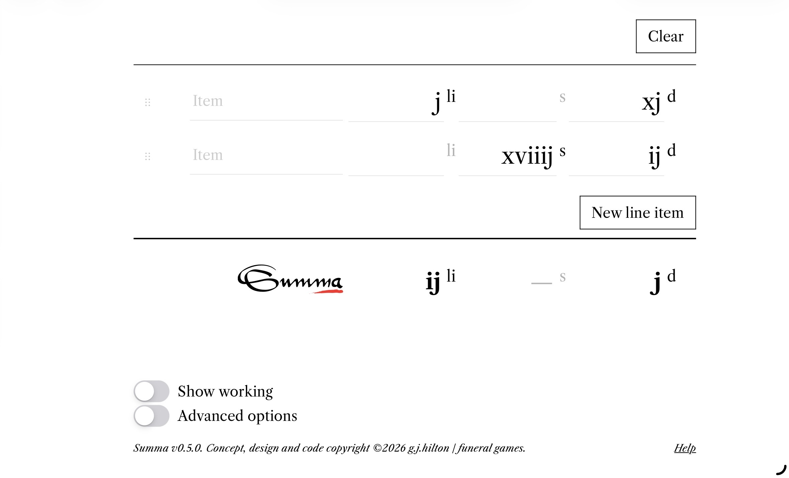
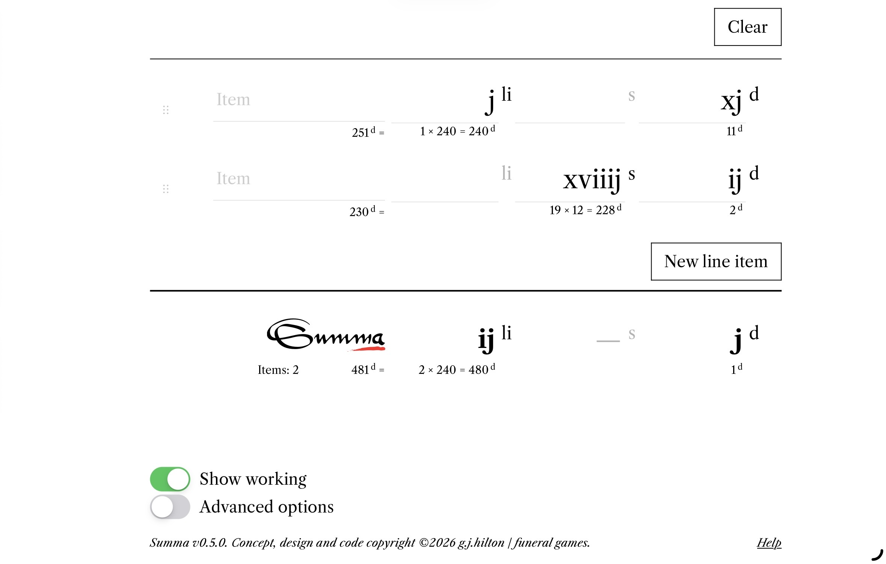
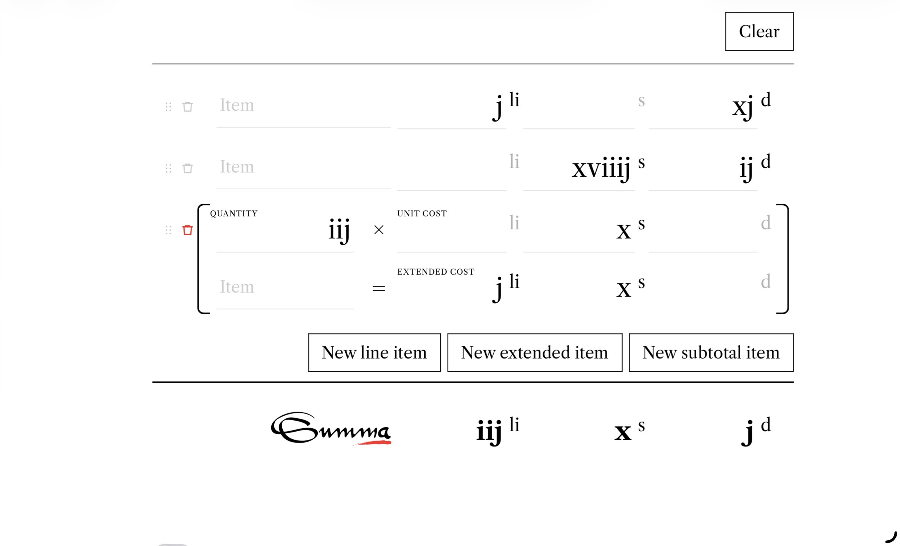
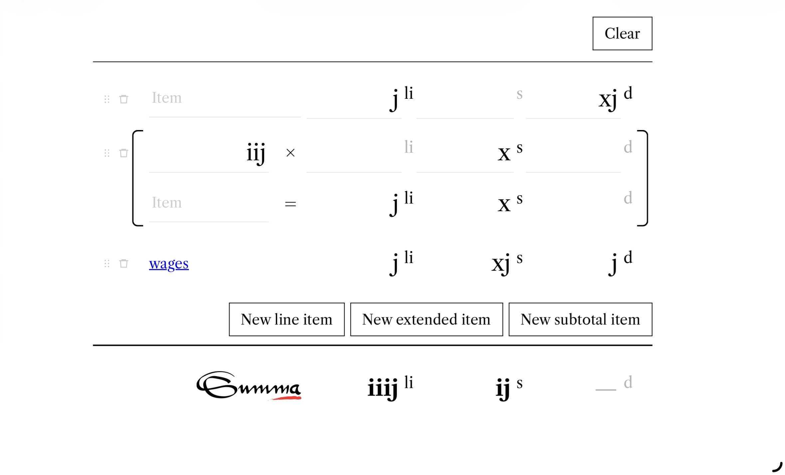

# Summa
## A simple spreadsheet for Early Modern British currency

[**Use Summa**](https://gjhilton.github.io/Summa/)

Summa is a simple spreadsheet for historians working with Early Modern British ledgers, accounts and similar documents.

For clerks of the era, summing columns of figures expressed as pounds, shillings and pence in Roman numerals was second nature. For modern users the calculations can be error-prone, and in large quantities quickly become tedious. Summa automates the calculation.

